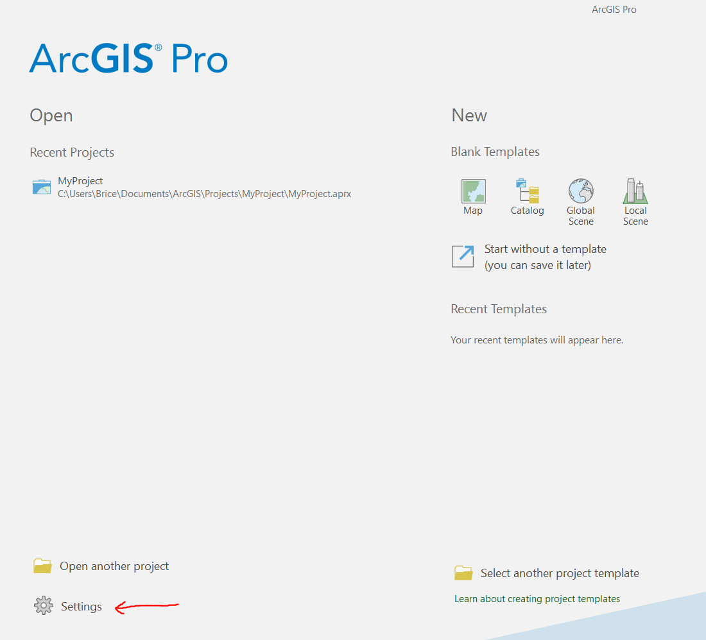
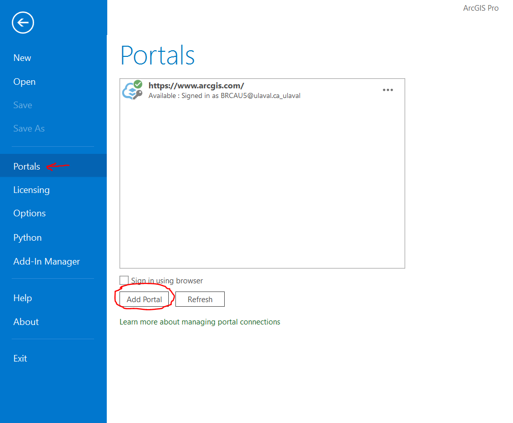
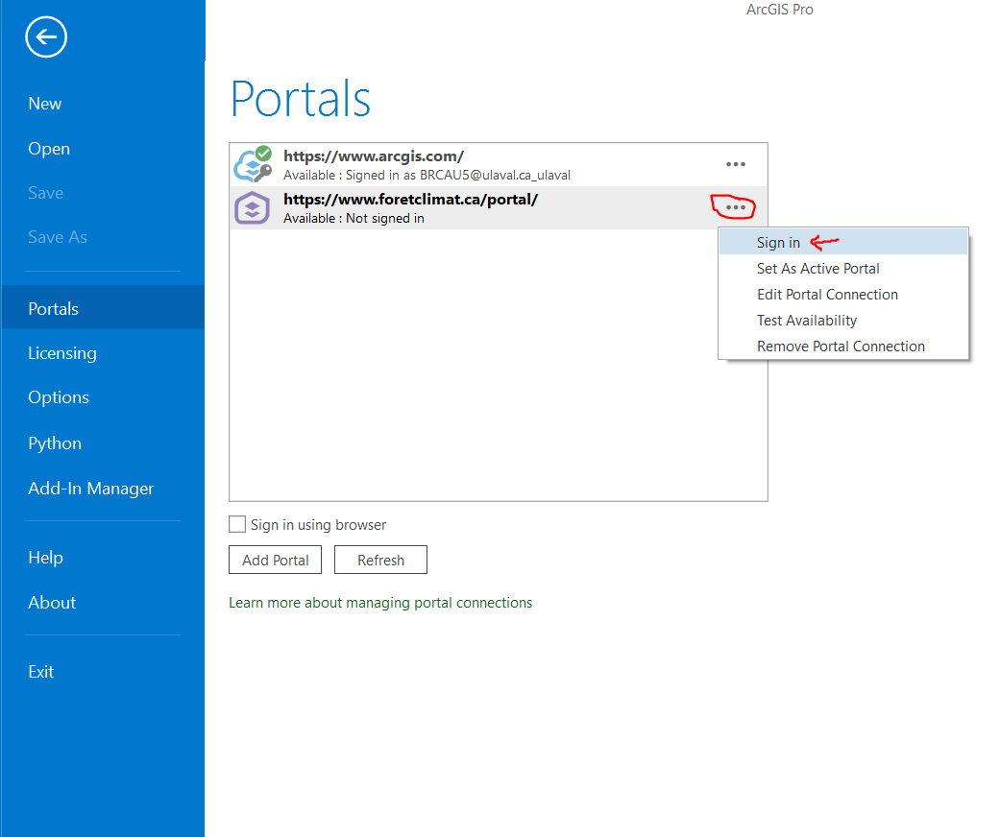
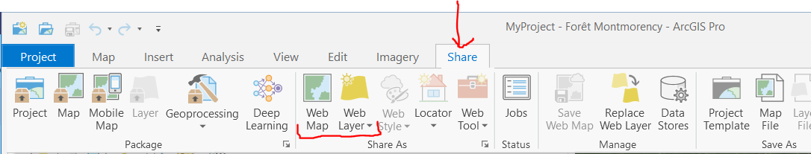

1.  [Setup ArcGIS Pro with the Portal]{.ul}

Open ArcGIS Pro and click "Settings"

After going into the "Portals" tab on the right, click on "Add Portal"

Enter the following URL: <https://www.foretclimat.ca/portal> in the
empty field.

You can then sign in by clicking "..." and then "Sign in".

Finally, "Set as Active Portal".

2.  [How to share with the Portal]{.ul}

You can choose to share as a "Web Map" or as a "Web Layer" in the
"Share" tab.

After filling in the fields, you can click "Share".
