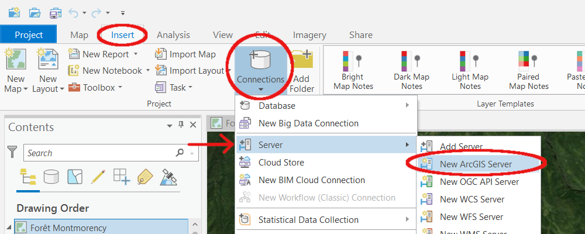
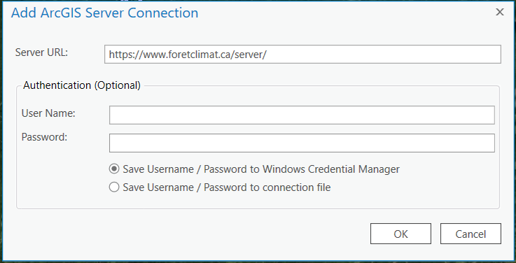
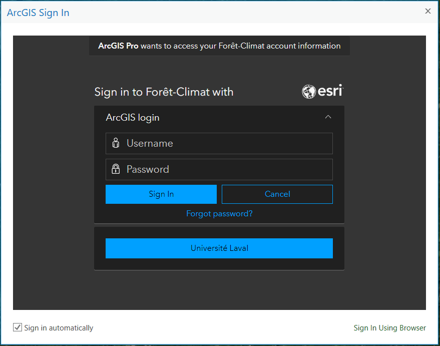

1. [Setup ArcGIS Pro with the Portal](https://github.com/jfaurelacroix/foretclimat/blob/main/usingPortal.md#1--setup-arcgis-pro-with-the-portal)
2. [How to share with the Portal](https://github.com/jfaurelacroix/foretclimat/blob/main/usingPortal.md#2--how-to-share-with-the-portal)
3. [Setup a database connection to the ArcGIS Server](https://github.com/jfaurelacroix/foretclimat/blob/main/usingPortal.md#3--setup-a-database-connection-to-the-arcgis-server)

---------------------------------------------
# 1.  Setup ArcGIS Pro with the Portal

Open ArcGIS Pro and click "Settings"

After going into the "Portals" tab on the right, click on "Add Portal"

Enter the following URL: <https://www.foretclimat.ca/portal> in the
empty field.

You can then sign in by clicking "..." and then "Sign in".

Finally, "Set as Active Portal".

# 2.  How to share with the Portal

You can choose to share as a "Web Map" or as a "Web Layer" in the
"Share" tab.

After filling in the fields, you can click "Share".

# 3.  Setup a database connection to the ArcGIS Server

Open a project and click on the "Insert" tab. Then, under "Connections", select the "Server" drop-down menu and click on "New ArcGIS Server".

You should see a popup asking you the Server URL. Enter: "https://www.foretclimat.ca/server" and hit "OK" (No need to enter the username and password just yet).

A second popup asking you to sign in to Forêt-Climat should appear.

You can sign in using your ArcGIS Forêt-Climat account if you have one but what you will probably want to do is click "Université Laval" under the sign in box and then you can sign in using your ULaval credentials.
